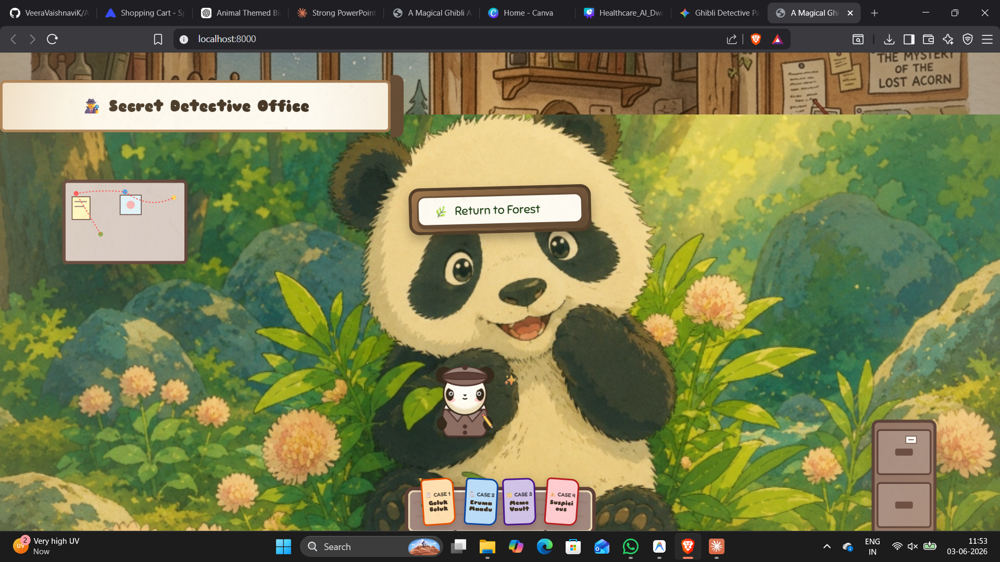

# 🌿 A Jungle Kingdom: Ghibli-Style Storybook Birthday Adventure 🐼🎂

Welcome to **A Jungle Kingdom**, a fully interactive, hand-painted Ghibli-style storybook web application built as a special gift for **Rejo's 20th Birthday**! 

Designed with a warm, nostalgic watercolor cream-paper texture, this website takes the traveler on a multi-chapter journey filled with cute animations, personalized memories, interactive mini-games, and a sentimental ending.

---

## 🖼️ Website Outcome



---

## 🎨 The Storybook Chapters

| Chapter | Scene / Title | Description |
| :--- | :--- | :--- |
| **Intro** | 🎋 Opening Bamboo Forest | A sleeping baby panda, floating wind-blown leaves, swaying wooden signboards, and a 3D-opening magical birthday letter invitation. |
| **Gate** | 🔑 Password & Bamboo Gates | An interactive login screen styled as a wooden signboard with DD/MM/YYYY auto-formatting. Includes custom crying panda physics-based teardrops and falling leaves upon incorrect attempts. |
| **Guard** | 🦍 Gorilla Gatekeeper | A friendly giant SVG gorilla holding a bamboo spear that chest-thumps and dances. Blocks access for intruders or opens the magical golden portal. |
| **Clearing** | 🎁 Birthday Surprise | A 3D folding page card asking a critical question, a custom crimson Ghibli gift box, and a guilt-tripping character parade (baby crying panda, working out baby gorilla, trotting buffalo, and wailing boy) if "NO" is clicked. |
| **Chap 1** | 🧸 Baby Rejo (Nursery Room) | A cozy baby nursery room with morning sunbeams, floating toy alphabet blocks, and polaroid baby pictures suspended on swaying ropes with wiggling luggage labels. |
| **Chap 2** | ⛰️ Growing Up (Gorilla Mountain) | A scroll-driven adventure map where scrolling up draws a baby climber panda up a winding coordinate-plotted SVG track path, leaving footprints, spawning peeking critters, and stamping achievement checkpoint stamps. |
| **Chap 3** | 🌸 Friendship Garden | Suspended double-rope memories carrying 8 polaroids. Clicking a polaroid turns open a premium 3D book modal displaying personalized Ghibli-esque stories on the left and handwritten quotes on the right. |
| **Secret** | 🕵️‍♂️ Detective Office | A hidden amber-glow room accessed via a wobbly `🚫 DO NOT CLICK` sign. Features a deerslayer panda detective rig tapping his pencil, wiggling dossier folders (Accused of pizza eating, professional sleep, and cute overload), and custom classified case reports. |
| **Chap 4** | 🎮 Ghibli Playhouse | An interactive arcade selection hub with warm wood floors and vine layouts offering 3 retro mini-games: Feed Goluk Boluk 🍔, Save Baby Panda 🐼, and Eruma Maadu Race 🐃. |
| **Chap 5** | 🌳 Achievement Tree | A mystical night canopy tree showing 8 medallion fruits that spin 720° and fly open when unlocked. |
| **Chap 6** | 🌌 Lantern Festival (Finale) | An unskypable cinematic movie projecting the cartoon best-friends video, accompanied by procedurally synthesized Ghibli-themed piano chords, floating amber sky lanterns, synced typewriter text, and a looping funny skit platform. |

---

## ✨ Core Interactive Features

* **3D Page-Flip Card Engine**: Meticulous CSS 3D perspectives (`transform-style: preserve-3d`) that realisticly flip open modals and books.
* **Scroll-Driven Bezier Pathing**: Real-time path tracing (`path.getPointAtLength`) that binds vertical mouse scrolling to the baby panda's climbing coordinate steps.
* **Procedural Ghibli Synth (Web Audio API)**: Real-time generated retro cartoon sound effects (munches, jumps, clacks, victories, and buzzes) to deliver premium feedback without downloading heavy assets.
* **Physics Particles**: gravity-driven weeping teardrops, floating fireflies, falling autumn leaves, drifting sky lanterns, and romantic floating heart spawners.
* **Responsive Mobile Optimization**: Tailored media queries that stack 3D book pages vertically and hide redundant background SVG vector overlays on mobile screens for a clean layout.

---

## 🛠️ Technical Stack

* **Core**: HTML5 (Semantic tags, inline animated SVGs)
* **Styling**: Vanilla CSS3 (Custom keyframe animations, 3D transforms, gradients)
* **Logic**: Vanilla ES6 JavaScript (Real-time coordinate calculations, DOM observers)
* **Audio**: HTML5 Web Audio API (Real-time procedural oscillator sound generation)
* **Hosting**: Vercel (Static files optimization, fast loading)

---

## 🚀 How to Run Locally

Since this is a client-side static application, you can run it locally with any simple HTTP server:

1. Clone the repository:
   ```bash
   git clone https://github.com/VeeraVaishnaviK/A-JUNGLE-KINGDOM---MVP-VERSION.git
   ```
2. Navigate into the directory:
   ```bash
   cd A-JUNGLE-KINGDOM---MVP-VERSION
   ```
3. Start a server:
   * **Python 3**:
     ```bash
     python -m http.server 8000
     ```
   * **Node.js**:
     ```bash
     npx http-server -p 8000
     ```
4. Open your browser and navigate to **`http://localhost:8000`**.

---

## 🌐 Deployment to Vercel

The repository is configured for automatic deployments. Every push to the `main` branch will trigger an optimized build on Vercel:

1. Connect your GitHub repository to [Vercel](https://vercel.com).
2. Set the directory to root `./`.
3. Vercel automatically detects the `index.html` and hosts the static assets.

Made with ❤️ for Rejo's 20th Birthday! 🎉
